# PDD_31_hw
Python: Creating a web service

## update 2022.06.17

* Added authentication_classes and permission_classes to ModelViewSet (see api_views.py).
* Implemented permissions.py.
* Implemented refresh token.

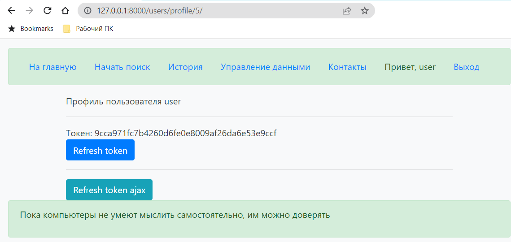

## update 2022.06.15: 
### Implemented Django Cleanup

### Ipmplemented Django REST Framework

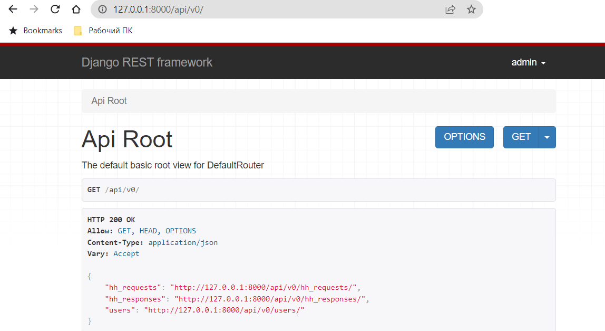

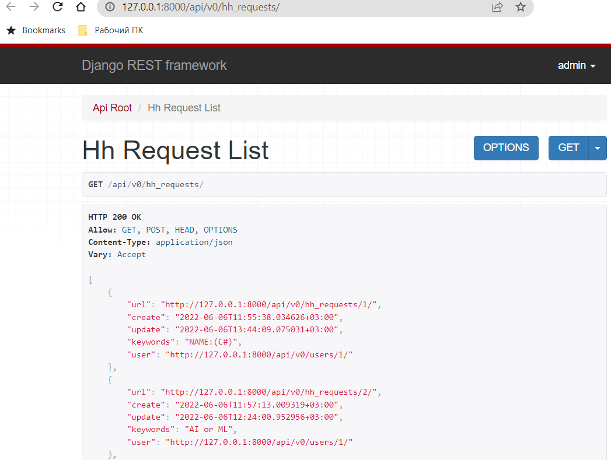

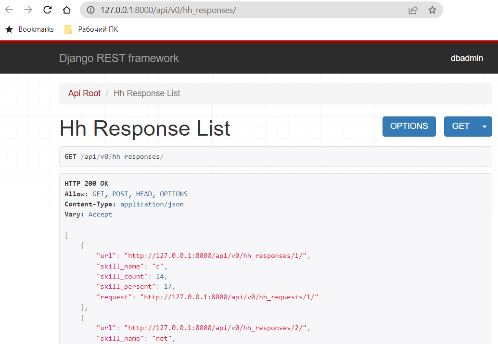

## update 2022.06.14 Deploying
### service nginx status

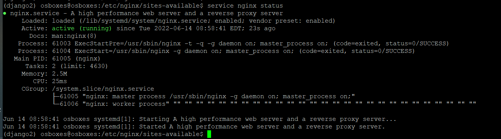

### sudo systemctl status gunicorn
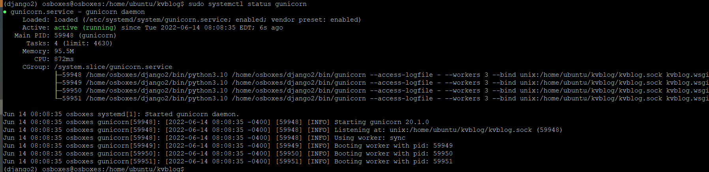

### Rusult:

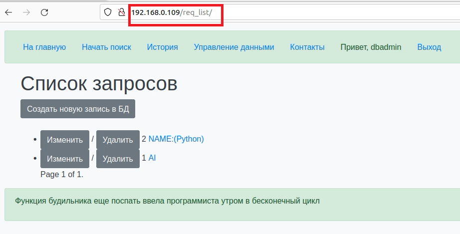

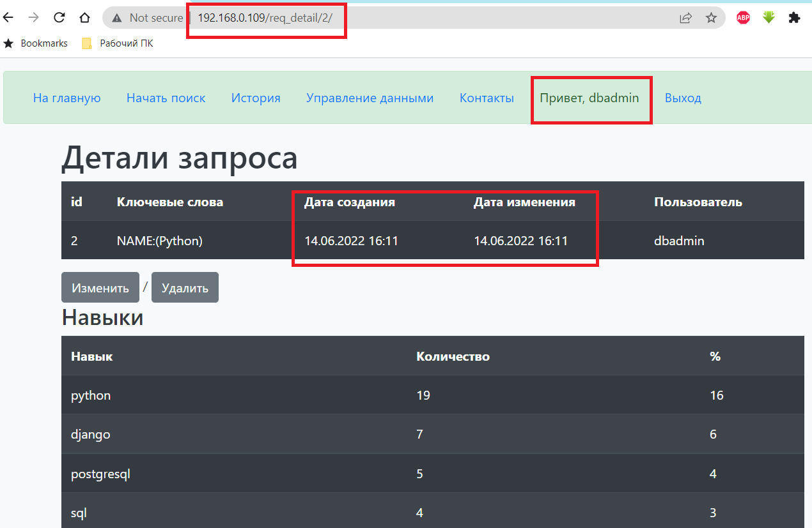

## update 2022.06.10 Site optimization

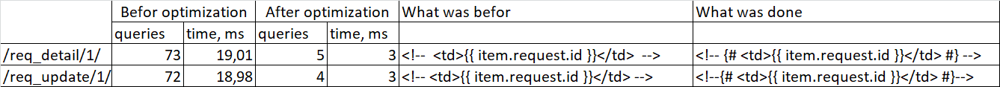

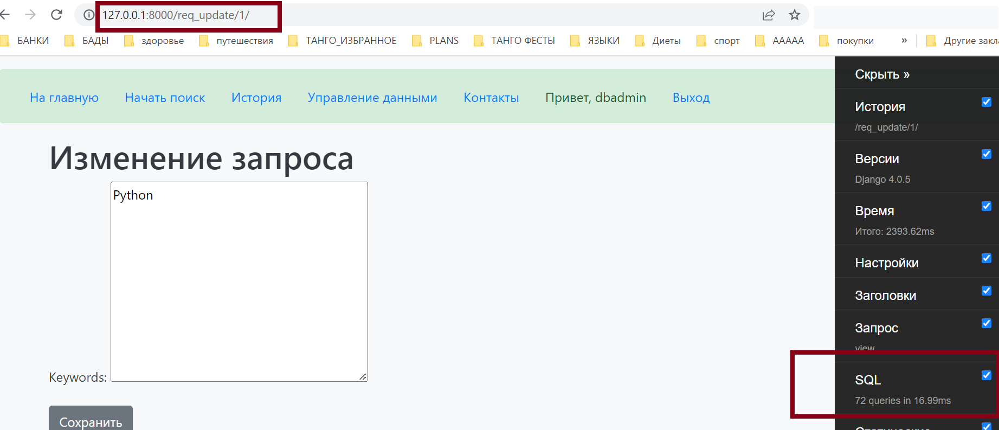

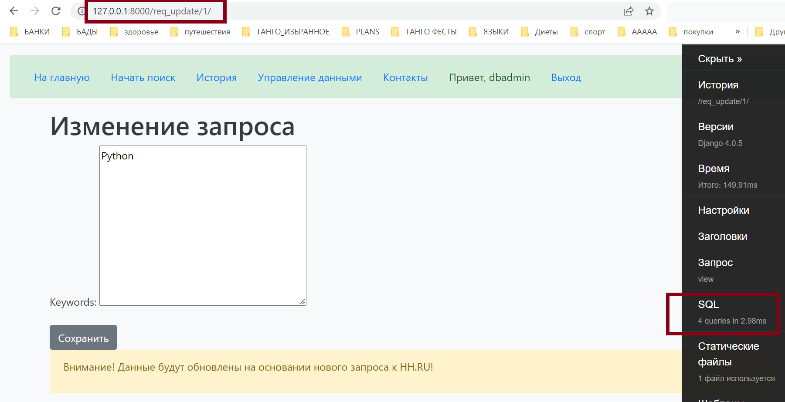

## update 2022.06.09
Added Paginator for the function ‘history’ and page ‘history.html’.

Added Paginator for the class ‘Hh_RequestListView’ and page req_list.html.

Added filter ‘|date:"SHORT_DATETIME_FORMAT"’at the page ‘req_detail.html’.

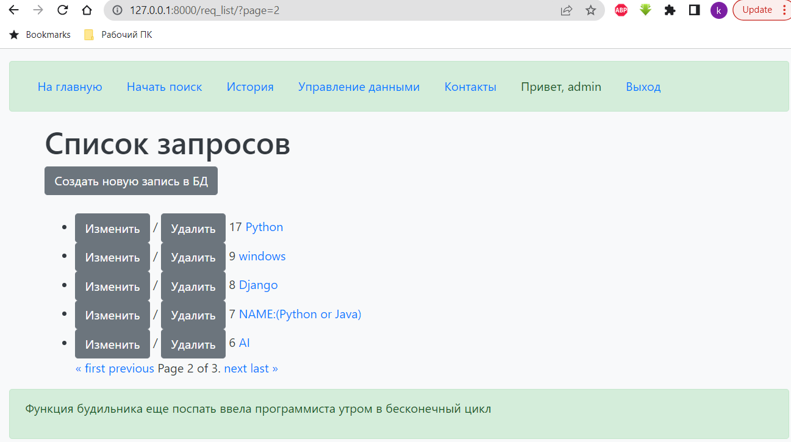

## update 2022.06.07
Added tests for the  views and its response codes.

Added tests for permissions and response pages for different users

## update 2022.06.06
Implemented user model: added new application 'usersapp'.

The menu items “Data management” (req_list.html), "Start searching" (form.html) and "History" (history.html) are available only for logged in users.

If user attribute is_dbAdmin = True than it’s possible to change data at the pages:

* req_detail.html
* req_update.html
* req_create.html
* req_delete.html

## Project
Project name is kvblog.

## Aplication:
Aplication name is 'blogapp'.

## Pages:
Implemented the base page (base.html):

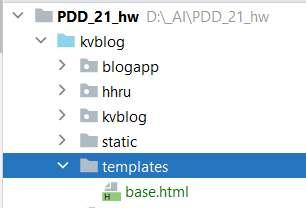

Static is here:

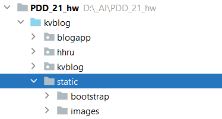

Implemented pages inherited from the base page:

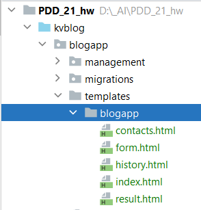

### index.html
index.html - the first page of the aplication;

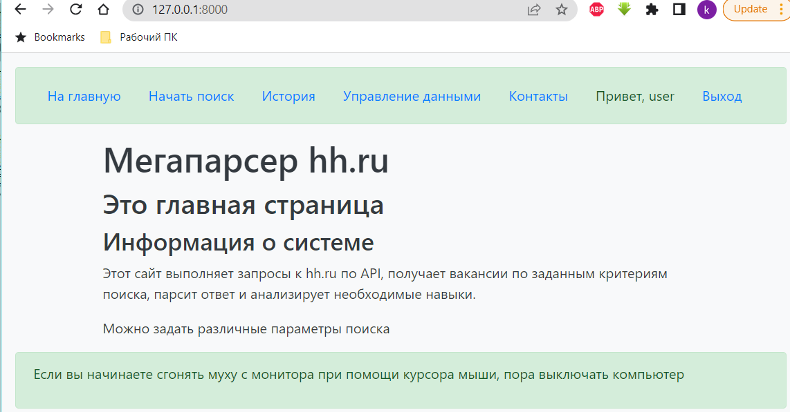

### form.html
form.html - the page with the form used for search at HH.RU;

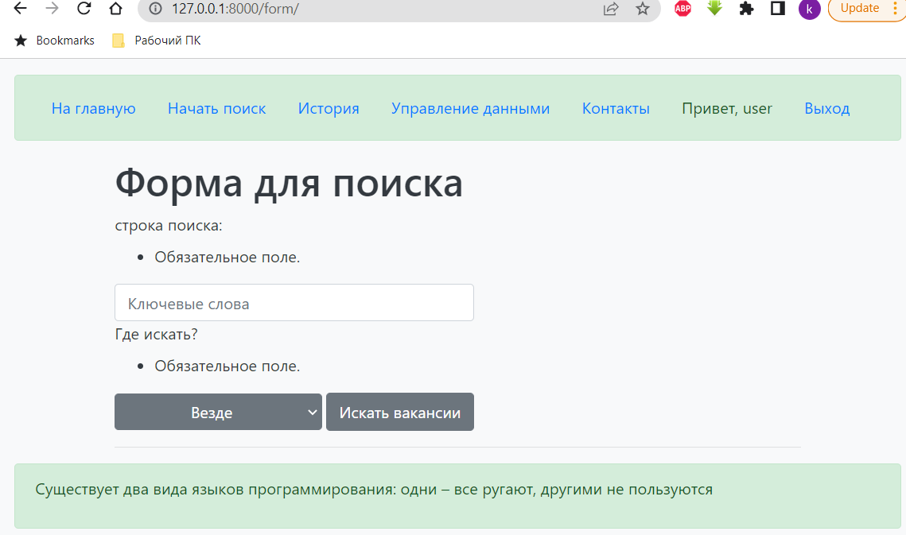

### result.html
result.html - the page with current result of the request at HH.RU;

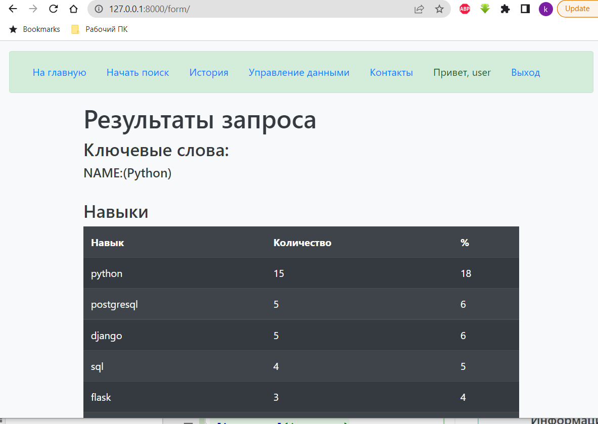

### history.html
history.html - the page with all saved request at the db;

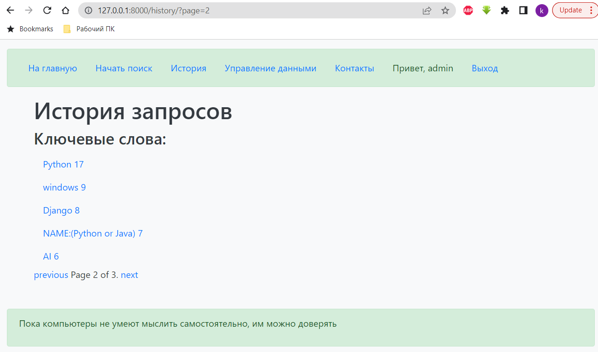

### contacts.html
contacts.html - the page with my contacts.

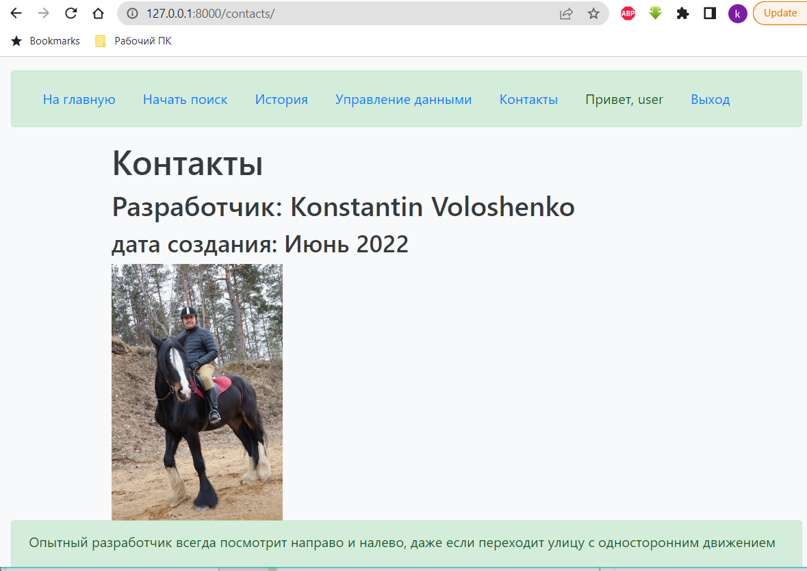

### 2022.06.06 Updated:
Added new navigation link ‘Управление данными’.

Added new pages:

* req_list.html
* req_detail.html
* req_update.html
* req_create.html
* req_delete.html

For these pages added class base views classes based on different view classes.

Added Mixin for the view classes

* Hh_RequestDetailView
* Hh_RequestUpdateView

### urls
Internal urls described here:

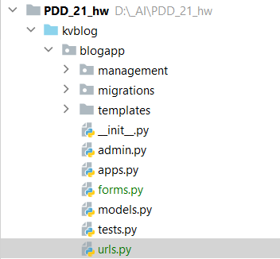

## Models:
Models names are:
* Hh_Request
* Hh_Response

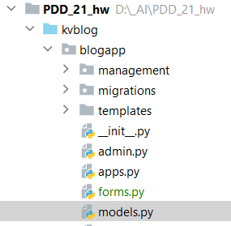

## Django commands:
Implemented two commands:
1. fill_db - to fill database with test data;
2. fill_db_parser - to fill databsse with parsed data from HH.RU

Examples:

python manage.py fill_db

python manage.py fill_db_parser

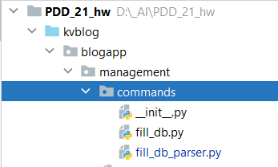